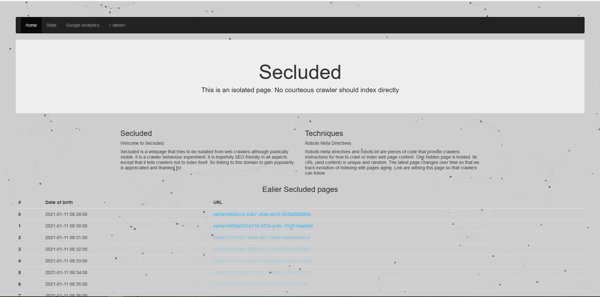

# Secluded

Secluded is a webpage that tries to be isolated from web crawlers although publically visible. It is a crawler behaviour experiment.

It is hopefully SEO friendly in all aspects except that it tells crawlers not to index itself. (So linking to this domain to gain popularity is appreciated and thanked for (not yet deployed)).

It uses morgan, lowdb, sqlite3, device-detector-js to detect and log crawlers.

One URL indexing is tracked with time going on to see how it ages. It also generates new links to see how evolution of indexing can be variable with website aging.

# How

Robots meta directives and robots.txt are pieces of code that provide crawlers instructions for how to crawl or index web page content. One hidden page is hosted. Its URL (and content) is unique and random. The latest page changes over time so that we track evolution of indexing with pages aging. Links are withing homepage so that crawlers can follow.

# A Glimpse of UI

Just the homepage.

# Contribution

Todo: 

A lot of things, basically only URL generation is done at this stage; No statistics logic was written.
A beautiful statistics dashboard.

Please see open issues for a specific issue, and do not hesitate to open any new issue (like better code, readability, modularity and best practice, performance, better UI or even functionality enhancements...).

Please know that I am not a keen NodeJS developer, but I successfully made this web application. It is in its early stage and not proper for final service yet.

If you contribute, please consider that I can merge and publish a new release under one channel or another. It will be 100% free although I can add ads to generate some coffee expenses :)

If you want to maintain the project with me; You can always ask.

Please keep it fair if you want to deploy anywhere; Ask for permission.

Sweet coding !
